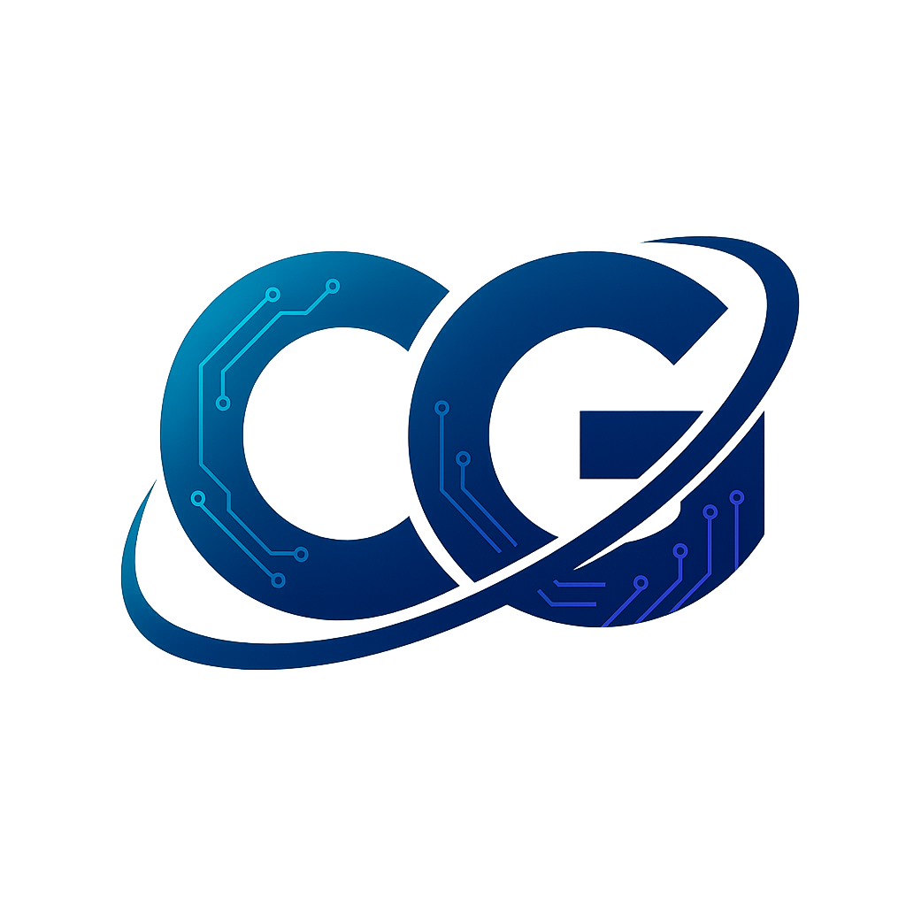

<div align="center">
  <br />
  <a href="https://codgen.in">
    
  </a>
  
  <h1 align="center">CodGen</h1>

  <p align="center">
    <b>Virtual Internship & IT Skill Development Platform 🚀</b>
  </p>
  
  <p align="center">
    <i>Learn by building real projects. Gain experience. Get certified.</i>
    <br />
    An internship ecosystem helping students step into the tech industry with confidence.
  </p>

  <p align="center">
    <a href="https://codgen.in">
      
    </a>
    <a href="https://forms.gle/xesRz7kpbowZ2cXE7">
      
    </a>
    <a href="https://linkedin.com/company/codgen-it">
      
    </a>
  </p>
</div>

<hr />

## 🧠 About CodGen

**CodGen** is an online internship ecosystem designed for IT and software development learners. Our mission is simple: **bridge the gap between theory and industry application.**

We provide guided tasks, mentorship support, real project modules, and a **verified completion certificate**. Whether you are a beginner or an intermediate student, CodGen helps you:

- ✅ **Master Workflows:** Learn Git, Deployment, and Agile basics.
- ✅ **Build Portfolio:** Create resume-worthy projects.
- ✅ **Gain Confidence:** Prepare for real job roles.
- ✅ **Get Certified:** Earn a professional internship certificate.

---

## 🚀 Key Features

<table>
  <tr>
    <td>🎓 <b>Virtual Internship</b></td>
    <td>Remote, flexible, and accessible from anywhere.</td>
  </tr>
  <tr>
    <td>🧩 <b>Real-World Tasks</b></td>
    <td>Work on modules that simulate actual industry tickets.</td>
  </tr>
  <tr>
    <td>🛠 <b>Modern Tech</b></td>
    <td>Hands-on experience with React, Next.js, Python, etc.</td>
  </tr>
  <tr>
    <td>🏆 <b>Certification</b></td>
    <td>Verified certificate upon successful completion.</td>
  </tr>
</table>

---

## 💼 Internship Domains

| Domain              | 🛠 Skills & Technologies Covered             |
| :------------------ | :------------------------------------------ |
| **Web Development** | HTML5, CSS3, JavaScript, React.js, Tailwind |
| **MERN Stack**      | MongoDB, Express.js, React.js, Node.js      |
| **Backend Dev**     | Express.js, PHP, Node.js, SQL/NOSQL         |
| **Data Science**    | Pandas, NumPy, Data Visualization, Analysis |
| **UI/UX Design**    | Figma, Prototyping, Design Systems          |

---

## 🛠 Tech Stack (Platform)

The CodGen platform itself is built using modern web technologies:

<div align="center">

|                                                                                             **Frontend**                                                                                             |                                                     **Styling**                                                      |                                           **Deployment**                                            |
| :--------------------------------------------------------------------------------------------------------------------------------------------------------------------------------------------------: | :------------------------------------------------------------------------------------------------------------------: | :-------------------------------------------------------------------------------------------------: |
|   |  |  |

</div>

---

## 📦 Installation & Local Setup

To run the CodGen platform locally on your machine:

```bash
# 1. Clone the repository
git clone [https://github.com/vanshsuri07/CodGen.git](https://github.com/vanshsuri07/CodGen.git)

# 2. Navigate to the project directory
cd codgen

# 3. Install dependencies
npm install

# 4. Start the development server
npm run dev
```

Open http://localhost:3000 with your browser to see the result.

---

## 🗂 Project Structure

```
codgen/

├── public/              # Static assets (images, icons)
├── src/
│   ├── app/             # Next.js App Router pages
│   ├── components/      # Reusable UI components
│   ├── styles/          # Global styles & Tailwind config
│   └── utils/           # Helper functions
├── sitemap.xml          # SEO Sitemap
├── robots.txt           # SEO Crawling rules
└── package.json         # Dependencies & Scripts
```

---

## 📩 Contact & Support

### Have questions or want to partner with us? 🤝

### Reach out anytime!

<p align="center">
  <a href="mailto:info@codgen.in"><b>📧 info@codgen.in</b></a>
  &nbsp;&nbsp;•&nbsp;&nbsp;
  <a href="https://linkedin.com/company/codgen-it"><b>🔗 LinkedIn</b></a>
  &nbsp;&nbsp;•&nbsp;&nbsp;
  <a href="https://codgen.in"><b>🌐 Website</b></a>
</p>

---

## 📄 License

This project is licensed under the MIT License — free to use & improve with credit.

© 2025 CodGen. All rights reserved.

---

<div align="center">
<br />
<h3>⭐️ Support the project</h3>
<p>If you find this project helpful, please give it a star on GitHub!</p>
<p>
<b>Made with passion for learners ❤️</b>
<br />
<i>CodGen – Learn. Build. Grow.</i>
</p>
</div>
